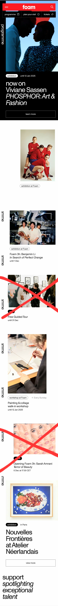
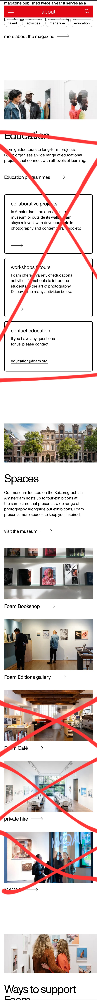
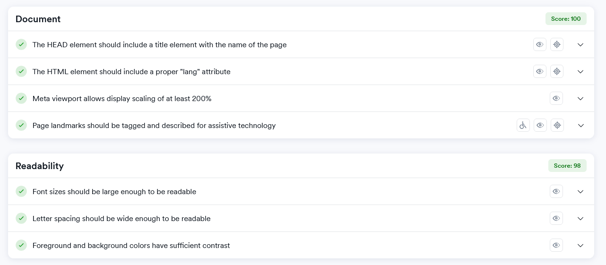
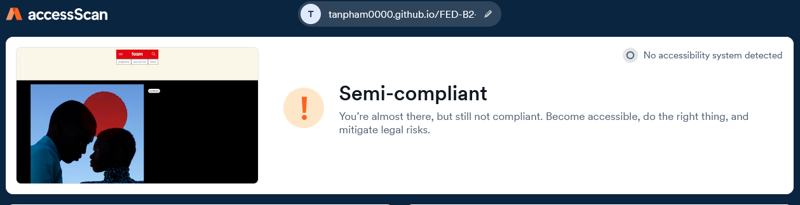
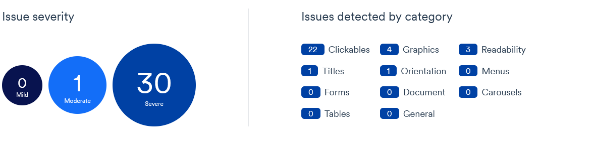
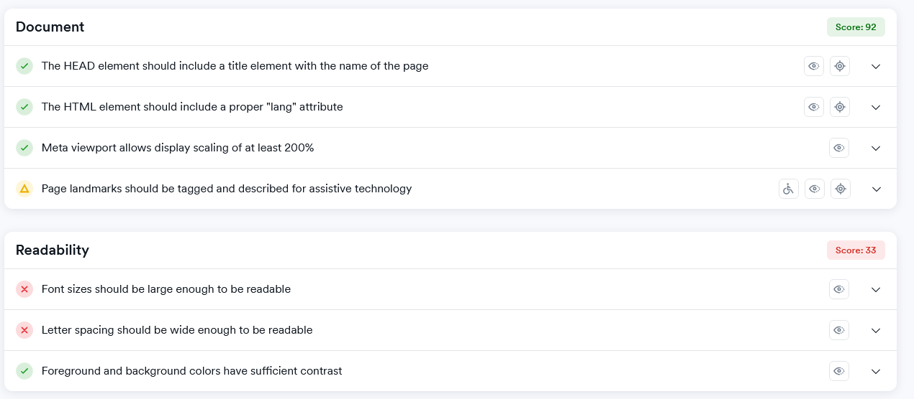
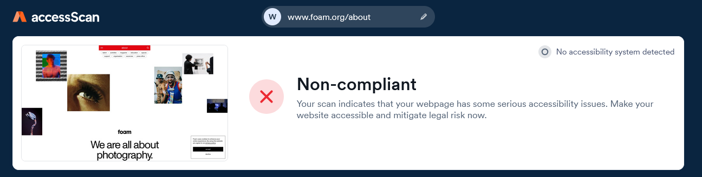
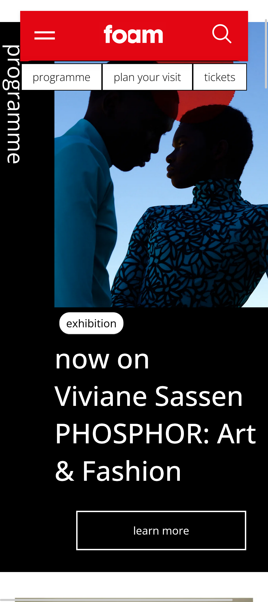
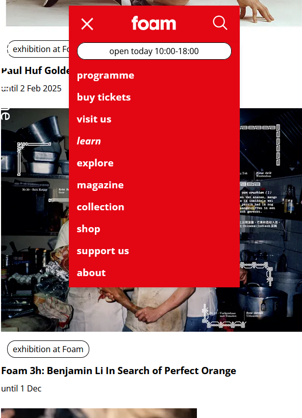

# Procesverslag
Markdown is een simpele manier om HTML te schrijven.  
Markdown cheat cheet: [Hulp bij het schrijven van Markdown](https://github.com/adam-p/markdown-here/wiki/Markdown-Cheatsheet).

Nb. De standaardstructuur en de spartaanse opmaak van de README.md zijn helemaal prima. Het gaat om de inhoud van je procesverslag. Besteedt de tijd voor pracht en praal aan je website.

Nb. Door *open* toe te voegen aan een *details* element kun je deze standaard open zetten. Fijn om dat steeds voor de relevante stuk(ken) te doen.

## Jij

  
uitwerken voor kick-off werkgroep

  ### Auteur:
  Tân Pham

  #### Je startniveau:
  Blauw, maar wilt een uitdaging
  #### Je focus:
  Responsive
 

## Je website

  
uitwerken voor kick-off werkgroep

  ### Je opdracht:
  link naar de website die je gaat namaken óf de naam/omschrijving van je eigen ontwerp

  FOAM fotografie museum
  https://www.foam.org/

  #### Screenshot(s) van de eerste pagina (small screen): 
  Home pagina 
  

  #### Screenshot(s) van de tweede pagina (small screen):
  About us
  
 

## Toegankelijkheidstest 1/2 (week 1)

  
uitwerken na test in 2e werkgroep

  ### Bevindingen
  https://accessibe.com/accessscan?website=https://www.foam.org/nl

  De website van het Foam is Non-compliant
  Op Accessibe liet ik de website testen om een snel overzicht voormezelf te krijgen.
  De screenreader pakt veel verschillende kopjes niet en is op sommige gevallen niet bruikbaar.
  De hoofdpagina mist een h1
  Gelukkig hebben alle foto's een alt tag
  

## Breakdownschets (week 1)

  
uitwerken na afloop 3e werkgroep

  ### de hele pagina: 
  
  De hoofdpagina heeft een aantal uitdagingen, waaronder de vele secties die van kleur wisselen en elementen die in en uit faden

  ### dynamisch deel (bijv menu): 
  

  Hamburger menu klapt naarbenenden open en maakt de achtergrond donker met een zwart vlak ook is het menu geanimeerd

## Voortgang 1 (week 2) Ziek

  
uitwerken voor 1e voortgang

  ### Stand van zaken
  hier dit ging goed & dit was lastig (neem ook screenshots op van delen van je website en code)

  ### Agenda voor meeting
  samen met je groepje opstellen

  | student 1      | student 2          | student 3    | student 4        |
  | ---            | ---                | ---          | ---              |
  | dit bespreken  | en dit             | en ik dit    | en dan ik dat    |
  | en dat ook nog | dit als er tijd is | nog een punt | dit wil ik zeker |
  | ...            | ...                | ...          | ...              |

  ### Verslag van meeting
  hier na afloop snel de uitkomsten van de meeting vastleggen

  - punt 1
  - punt 2
  - nog een punt
- ...

## Voortgang 2 (week 3)

  
uitwerken voor 2e voortgang

  ### Stand van zaken
  hier dit ging goed & dit was lastig (neem ook screenshots op van delen van je website en code)
  

  ### Agenda voor meeting
  samen met je groepje opstellen

  | student 1      | student 2          | student 3    | student 4        |
  | ---            | ---                | ---          | ---              |
  | dit bespreken  | en dit             | en ik dit    | en dan ik dat    |
  | en dat ook nog | dit als er tijd is | nog een punt | dit wil ik zeker |
  | ...            | ...                | ...          | ...              |

  ### Verslag van meeting
  hier na afloop snel de uitkomsten van de meeting vastleggen

  - Navigatie omzetten naar Hamburger menu
  - Vergeet Grid voor de gehele pagina, alleen gebruiken voor details
  - Mist een breakdownschets

## Toegankelijkheidstest 2/2 (week 4)

  
uitwerken na test in 9e werkgroep

  ### Bevindingen
  
  
  
  
  
  mijn site die doet het al erg goed,

## Voortgang 3 (week 4)

  
uitwerken voor 3e voortgang

  ### Stand van zaken
  Ik liep tegen een aantal dingen aan, zeker als het ging om verschillende animaties
  Ook was de navigatie nog niet helemaal hoe ik het wou hebben.
  De validator liet 1 fout zien binnen mijn css, waardoor de grote van een element niet helemaal klopt ook had ik nog niet alle alt tags toegevoegd.

  

  ### Agenda voor meeting
  samen met je groepje opstellen

  | student 1      | student 2          | student 3    | student 4        |
  | ---            | ---                | ---          | ---              |
  | dit bespreken  | en dit             | en ik dit    | en dan ik dat    |
  | en dat ook nog | dit als er tijd is | nog een punt | dit wil ik zeker |
  | ...            | ...                | ...          | ...              |

  ### Verslag van meeting
  hier na afloop snel de uitkomsten van de meeting vastleggen

  - Validator checken
  - Gebruik minder classes en logische class namen
  - vergeet de Main en Header niet
  - Focus op de belangrijke dingen zoals het netjes maken van de pagina & sections.
  - ID scrolling text voor text change
  - Zorg dat de foto's binnen hun container blijft
  - ...

## Eindgesprek (week 5)

  
uitwerken voor eindgesprek

  ### Je uitkomst - karakteristiek screenshots:
  
  Het eerste scherm dat je na de intro ziet.

  ### Dit ging goed/Heb ik geleerd: 
  Ik heb ontzettend veel geleerd, ik heb met deze site zoveel kunnen proberen en experimenteren waardoor mijn begrip van de programeer talen beter zijn geworden. Het gaat heel goed wanneer er een doel is en een site is waar je direct naar kan kijken voor de vormgeving.
  

  ### Dit was lastig/Is niet gelukt:
  Ik wou hier een functie maken als je muis over de section heen gaat dan zou er een trail aan foto's erachter komen.
  Ik heb dit effect eerder gezien in een youtube video @Hyperplexed https://www.youtube.com/watch?v=Jt3A2lNN2aE&t=70s 
  Jammer genoeg ben ik daar niet aan toegekomen

  

## Bronnenlijst

  
continu bijhouden terwijl je werkt

 1. Chatgpt, ik heb aan gpt gevraagd om mijn code na te kijken en of er dubbele/onnodige code tussen zit.
 Ook heeft het een groot deel mee gedaan aan de javascript. 
 2. Bahaa en ik hebben samen gewerkt aan de achtergrond scroll functie
 3. https://css-tricks.com/snippets/css/a-guide-to-flexbox/  
 4. https://www.youtube.com/watch?v=Qhaz36TZG5Y @fireship
 5. https://www.youtube.com/watch?v=PL3Odw-k8W4 @coding2go voor shorthanding code
 6. https://www.shecodes.io/athena/33067-how-to-remove-dots-in-an-html-list 
 7. https://www.shecodes.io/athena/86970-how-to-hide-an-image-in-css
 8. https://www.shecodes.io/athena/21966-how-to-add-a-shadow-to-a-button-in-css
 9. https://www.shecodes.io/athena/10151-how-to-change-text-when-clicking-in-javascript
 10. https://www.w3schools.com/howto/howto_js_mobile_navbar.asp
 11. https://dev.to/webdeasy/10-awesome-css-hamburger-menus-1iho

